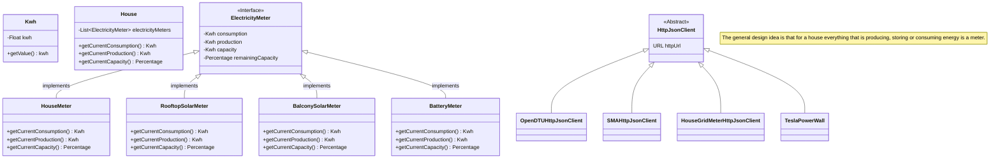

* CI/CD with GitHub Actions
* native compile via GraalVM
* optimized Java Docker image
* publishing of data to GrafanaCloud

```mermaid
classDiagram
note "The general design idea is that for a house everything that is producing, storing or consuming energy is a meter."

    class Kwh {
	    -Float kwh
	    +getValue() kwh
    }

    class House {
	    -List~ElectricityMeter~ electricityMeters
	    +getCurrentConsumption() Kwh
	    +getCurrentProduction() Kwh
	    +getCurrentCapacity() Percentage
    }

    class ElectricityMeter {	<<Interface>>
	    -Kwh consumption
	    -Kwh production
	    -Kwh capacity
	    -Percentage remainingCapacity
    }

    class BalconySolarMeter {
	    +getCurrentConsumption() Kwh
	    +getCurrentProduction() Kwh
	    +getCurrentCapacity() Percentage
    }

    class RooftopSolarMeter {
	    +getCurrentConsumption() Kwh
	    +getCurrentProduction() Kwh
	    +getCurrentCapacity() Percentage
    }

    class HouseMeter {
	    +getCurrentConsumption() Kwh
	    +getCurrentProduction() Kwh
	    +getCurrentCapacity() Percentage
    }

    class BatteryMeter {
	    +getCurrentConsumption() Kwh
	    +getCurrentProduction() Kwh
	    +getCurrentCapacity() Percentage
    }

    ElectricityMeter <|-- HouseMeter : implements
    ElectricityMeter <|-- RooftopSolarMeter : implements
    ElectricityMeter <|-- BalconySolarMeter : implements
    ElectricityMeter <|-- BatteryMeter : implements

    class HttpJsonClient { <<Abstract>> 
      URL httpUrl
    }

    HttpJsonClient <|-- OpenDTUHttpJsonClient
    HttpJsonClient <|-- SMAHttpJsonClient
    HttpJsonClient <|-- HouseGridMeterHttpJsonClient
    HttpJsonClient <|-- TeslaPowerWall
```
	

